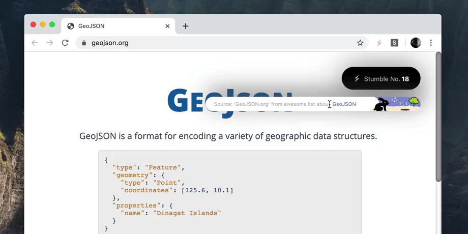

#  StumbleUponAwesome
An *awesome* internet discovery button, for developers, tech and science lovers. 

  

> A Chrome/Brave extension that takes you to a random site from one of the [awesome curated lists](https://github.com/sindresorhus/awesome). Like good ol' StumbleUpon (which is now dead). 

⚡️ [Install the extension from the Chrome Web Store](https://chrome.google.com/webstore/detail/stumbleuponawesome/dhfmgppomdaagdcbpccdfjpopgikcdge?authuser=3)

There are 32,443 unique sites from 528 awesome collection pages on Github from kind contributors. There's some hidden gems waiting in there. 

----

## How to use it:
**To stumble:** Simply click on the ⚡️ extension button → go to a new awesome site!
<small>(or use **`Alt`** + **`Shift`** +**`S`**)</small>

### ꩜ New: Rabbit hole 

_We have all been down internet rabbit holes_.  
. 
One minute you're casually reading the news, the next you've read so much about `random topic` you might as well do a TED talk.  
. 
_What just happened?_ The rabbit hole pulled you in and you lost track of time, but you also might have discovered something _awesome_.  
. 
So why not embrace it, by having a fancy button for it, _obviously_. **Stay stumblin' on the same topic,** or exit back to random mode. 

  

---

### Setup

1. Clone or fork this repository
2. Open Chrome/Brave or other Chromium-based browser
3. Open the extensions page at `chrome://extensions`
4. Enable developer mode 
5. Click "Load unpacked" and select the `/extension` folder. 

### Development

Here's some of the things I'd like to build out for this extension. However the main one right now is simply to curate the links as good as I can, add more data sources and make sure the pages are a good mix of interesting, useful, fun and exciting. 

- [ ] Feedback mechanism for good/bad links
- [ ] Favourite 'gems' to bookmark folder
- [ ] Basic stats
- [ ] Categories
  - [x] [awesome curated lists](https://github.com/sindresorhus/awesome)
  - [ ] tech, science, software, startups, etc.
- [x] Rabbit hole feature (stay on the same topic). _Done, not yet published_

**[→ Changelog](CHANGELOG.md)**

**[→ Current version: 1.0.6](https://chrome.google.com/webstore/detail/stumbleuponawesome/dhfmgppomdaagdcbpccdfjpopgikcdge?authuser=3)**

### A note about permissions
This extension requires the `<all_urls>` permission, in order to show the overlay UI on every stumble page that you visit. It does not access data on these sites. There is no tracking, or analytics of any kind, and state is only stored locally. 

### Credit to the curators ✔
This extension is made possible by awesome people curating the internet:
- [sindresorhus/awesome](https://github.com/sindresorhus/awesome) and [all the awesome list authors](https://github.com/sindresorhus/awesome/graphs/contributors)

### A note about the dataset
It's completely local - you can find it under [/extension/data](./extension/data). It's generated with [awesome_scraper.py](./scraper/awesome_scraper.py). 

##### Maintaining quality
To make sure that every link works and is relevant, the dataset is cleaned. Any dead or broken links are removed, as well as links to CI pipelines, recursive links, donation links, etc. This is done with the cleanup functions in [utils.py](./scraper/utils.py). Running this script can take a few hours on a slow connection.

##### Broken links
After removing from the dataset, a record of dead or broken links (those with 404, SSL, other server errors) is saved in [these text files](./extension/data/broken-urls) after every scrape. 

❗️If you are one of the awesome list maintainers, find the **[ text file for your awesome-list](./extension/data/broken-urls)** to check for dead links and remove them from your list, or update with a valid URL. If the file is empty, all good! 

#### Contribute

[☝️Submit an issue](https://github.com/basharovV/StumbleUponAwesome/issues/new)
[🤘Submit a PR](https://github.com/basharovV/StumbleUponAwesome/pulls)

✨ Stay curious!
