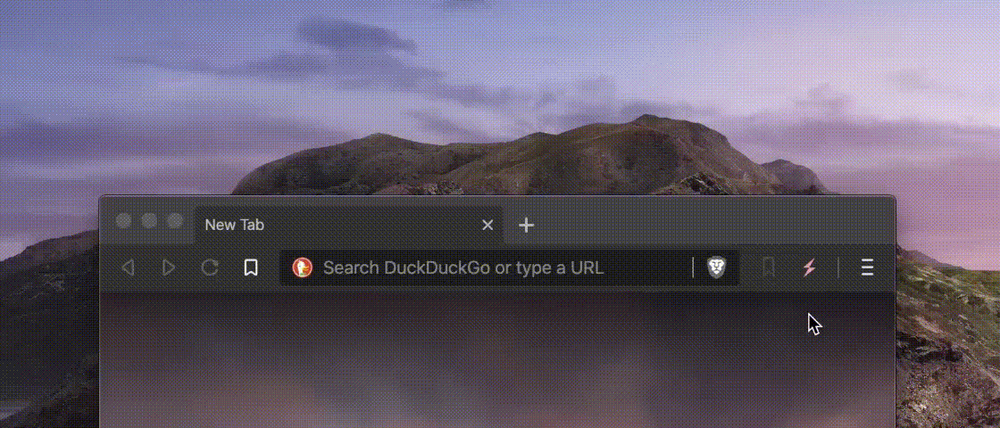

#  StumbleUponAwesome
An *awesome* internet discovery button, for developers, tech and science lovers. 

  

> A Chrome/Brave extension that takes you to a random site from one of the [awesome curated lists](https://github.com/sindresorhus/awesome). Like good ol' StumbleUpon (which is now dead). 

⚡️ [Install the extension from the Chrome Web Store](https://chrome.google.com/webstore/detail/stumbleuponawesome/dhfmgppomdaagdcbpccdfjpopgikcdge?authuser=3)

There are 32,443 unique sites from 528 awesome collection pages on Github from kind contributors. There's some hidden gems waiting in there. 

**How to use:**
Click on the ⚡️ extension to go to a new awesome site, or press keyboard shortcut **Alt+Shift+S**

---

### Setup

1. Clone or fork this repository
2. Open Chrome/Brave or other Chromium-based browser
3. Open the extensions page at `chrome://extensions`
4. Enable developer mode 
5. Click "Load unpacked" and select the `/extension` folder. 

### Development

Here's some of the things I'd like to build out for this extension. However the main one right now is simply to curate the links as good as I can, add more data sources and make sure the pages are a good mix of interesting, useful, fun and exciting. 

- [ ] Feedback mechanism for good/bad links
- [ ] Favourite 'gems' to bookmark folder
- [ ] Basic stats
- [ ] Categories
  - [x] [awesome curated lists](https://github.com/sindresorhus/awesome)
  - [ ] tech, science, software, startups, etc.

**[→ Changelog](CHANGELOG.md)**

**[→ Current version: 1.0.5.](https://chrome.google.com/webstore/detail/stumbleuponawesome/dhfmgppomdaagdcbpccdfjpopgikcdge?authuser=3)**

### A note about permissions
This extension requires the `<all_urls>` permission, in order to show the overlay UI on every stumble page that you visit. It does not access data on these sites. 

### Credit to the curators ✔
This extension is made possible by awesome people curating the internet:
- [sindresorhus/awesome](https://github.com/sindresorhus/awesome) and [all the awesome list authors](https://github.com/sindresorhus/awesome/graphs/contributors)

#### Contribute

[☝️Submit an issue](https://github.com/basharovV/StumbleUponAwesome/issues/new)
[🤘Submit a PR](https://github.com/basharovV/StumbleUponAwesome/pulls)

✨ Stay curious!
